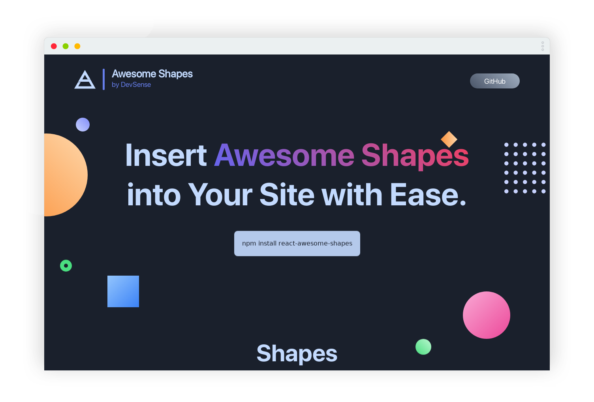

<div align="center">

</div>

<h1 align="center">React Awesome Shapes</h1> 

<h3 align="center">🌀 Insert Awesome Shapes into Your React Site with Ease.</h3>

<p align="center">
  <a href="https://hits.seeyoufarm.com"></a>
  <a href="https://nodejs.org/en/blog/release/v16.14.0/"></a>
  <a href="https://www.npmjs.com/package/npm/v/8.3.1"></a>
  <a href="https://github.com/prettier/prettier"></a>
  <br/>
  <a href="https://app.netlify.com/sites/awesomeshapes/deploys"></a>
  <a href="https://github.com/ashutosh1919/react-awesome-shapes/blob/main/LICENSE"></a>
  <a href="https://github.com/ashutosh1919/react-awesome-shapes/commits/main"></a>
  <a href="https://awesomeshapes.netlify.app/"></a>
  <a href="https://img.shields.io/badge/price-free-ff69b4"></a>
</p>

<p align="center">Loved the project? Please consider <a href="https://github.com/sponsors/ashutosh1919">donating</a> to help it improve!</p>
<p align="center">Consider following <a href="https://youtube.com/c/DevSense19">DevSense</a> on YouTube.</p>
<p align="center">If you want to discuss about something, then you can ask on official <a href="https://discord.com/invite/GkcbM5bwZr">Discord Server</a>.</p>

<p align="center"> 
    <a href="https://awesomeshapes.netlify.app/" target="_blank">
    </img>
  </a>
</p>
:star: Star us on GitHub — it helps!  

# Getting Started 🎬

The easiest way to use one of the shapes from **Awesome Shapes** is to install the NPM package and import the particular shape to use it.

## Install NPM Package

```bash
npm install react-awesome-shapes
```

## Import And Use

```jsx highlight={1,6}
import { ShapeName } from "react-awesome-shapes";
...
function ShapeComponent(props) {
    return (
        ...
        <ShapeName {...passParametersToCustomise} />
        ...
    );
}

export default ShapeComponent;
```

The shapes are very easier to import and use wherever you want and in any web framework that uses NPM.  
You can set different sizes of different variety of shapes by passing props.

Read the complete in detail documentation in the [Usage section](https://github.com/ashutosh1919/react-awesome-shapes#usage).  


## Usage

Currently, the package contains shapes: [Circle](https://github.com/ashutosh1919/react-awesome-shapes/blob/main/src/lib/shapes/circle.tsx), [Donut](https://github.com/ashutosh1919/react-awesome-shapes/blob/main/src/lib/shapes/donut.tsx), [CircleGrid](https://github.com/ashutosh1919/react-awesome-shapes/blob/main/src/lib/shapes/circlegrid.tsx), [Square](https://github.com/ashutosh1919/react-awesome-shapes/blob/main/src/lib/shapes/square.tsx), [Diamond](https://github.com/ashutosh1919/react-awesome-shapes/blob/main/src/lib/shapes/diamond.tsx), [PolygonCard](https://github.com/ashutosh1919/react-awesome-shapes/blob/main/src/lib/shapes/polygonCard.tsx), [Triangle](https://github.com/ashutosh1919/react-awesome-shapes/blob/main/src/lib/shapes/triangle.tsx), [Hexagon](https://github.com/ashutosh1919/react-awesome-shapes/blob/main/src/lib/shapes/hexagon.tsx), [Polygon](https://github.com/ashutosh1919/react-awesome-shapes/blob/main/src/lib/shapes/polygon.tsx).

All of the shapes currently present in the package are made responsive and the responsiveness is customisable too. To do that, one of the prop to each shape component is `breakpoints` which is an array of numbers. It represents the breakpoints in which you will define the responsiveness. By default, `breakpoints` are defined as `[600, 900, 1200]`. So, you can pass array of 4 elements for `size` prop which corresponds to `<=600`, `600<size<=900`, `900<size<=1200`, `>1200`. Similarly, you can pass other props in form of array if you want to define different sizes for different breakpoints. You can see list of props corresponding to each shape in the respective implementation file linked above with shape.

By default, all the shapes have `position: absolute;` so that you can define the coordinates to put the shapes to exact position. But you can change the `position` attribute in case you want.

Basic usage of the Shape in your react site is illustrated on the [project website](https://awesomeshapes.netlify.app/).

# License 📄

This project is licensed under the MIT License - see the [LICENSE.md](https://github.com/ashutosh1919/react-awesome-shapes/blob/main/LICENSE) file for details.
You can use this project for personal as well as commercial purposes. But if you think you have modified the project and built something really good, we will humbly request you to raise the pull request and share with the opensource community.

# Contributing 💡

‌Awesome Shapes is created with the help of what is available for free on the internet and hence it will always be available for free. This makes it an open source project and everyone are welcome to contribute to different aspects of the project.

You may want to contribute on adding new shapes, fixing bugs, improving/refactoring code etc.

If you can help us with these, please don't hesitate to open a [pull request](https://github.com/ashutosh1919/react-awesome-shapes/pulls) or an [issue](https://github.com/ashutosh1919/react-awesome-shapes/issues). If you want to know about how to create pull request, then please refer to [this youtube playlist](https://youtube.com/playlist?list=PLR0CKdeR_FyscaxEksDVXc4UQvlOFLYS6).

## Contributors ✨

Thanks goes to these wonderful people ([emoji key](https://allcontributors.org/docs/en/emoji-key)):

<!-- ALL-CONTRIBUTORS-LIST:START - Do not remove or modify this section -->
<!-- prettier-ignore-start -->
<!-- markdownlint-disable -->
<table>
  <tr>
    <td align="center"><a href="https://github.com/ashutosh1919"><br /><sub><b>Ashutosh Hathidara</b></sub></a><br /><a href="https://github.com/ashutosh1919/react-awesome-shapes/commits?author=ashutosh1919" title="Code">💻</a> <a href="#design-ashutosh1919" title="Design">🎨</a> <a href="https://github.com/ashutosh1919/react-awesome-shapes/commits?author=ashutosh1919" title="Documentation">📖</a> <a href="#ideas-ashutosh1919" title="Ideas, Planning, & Feedback">🤔</a> <a href="#maintenance-ashutosh1919" title="Maintenance">🚧</a> <a href="#research-ashutosh1919" title="Research">🔬</a></td>
    <td align="center"><a href="https://sachinchaurasiya.dev/"><br /><sub><b>Sachin Chaurasiya</b></sub></a><br /><a href="https://github.com/ashutosh1919/react-awesome-shapes/commits?author=Sachin-chaurasiya" title="Documentation">📖</a> <a href="https://github.com/ashutosh1919/react-awesome-shapes/commits?author=Sachin-chaurasiya" title="Code">💻</a> <a href="#ideas-Sachin-chaurasiya" title="Ideas, Planning, & Feedback">🤔</a> <a href="#platform-Sachin-chaurasiya" title="Packaging/porting to new platform">📦</a></td>
    <td align="center"><a href="http://mohittk.github.io"><br /><sub><b>Mohit Khairnar</b></sub></a><br /><a href="#ideas-mohittk" title="Ideas, Planning, & Feedback">🤔</a> <a href="https://github.com/ashutosh1919/react-awesome-shapes/commits?author=mohittk" title="Code">💻</a> <a href="#design-mohittk" title="Design">🎨</a> <a href="https://github.com/ashutosh1919/react-awesome-shapes/commits?author=mohittk" title="Documentation">📖</a></td>
    <td align="center"><a href="https://github.com/anaghaachakrapani"><br /><sub><b>anaghaachakrapani</b></sub></a><br /><a href="#design-anaghaachakrapani" title="Design">🎨</a> <a href="#ideas-anaghaachakrapani" title="Ideas, Planning, & Feedback">🤔</a></td>
    <td align="center"><a href="https://amansethi.netlify.app"><br /><sub><b>Aman Sethi</b></sub></a><br /><a href="https://github.com/ashutosh1919/react-awesome-shapes/commits?author=amansethi00" title="Code">💻</a></td>
  </tr>
  <tr>
    <td align="center"><a href="http://judyn.me"><br /><sub><b>judy-n</b></sub></a><br /><a href="https://github.com/ashutosh1919/react-awesome-shapes/commits?author=judy-n" title="Code">💻</a></td>
    <td align="center"><a href="https://www.julienbl.me"><br /><sub><b>Julien Bertazzo Lambert</b></sub></a><br /><a href="https://github.com/ashutosh1919/react-awesome-shapes/commits?author=JLambertazzo" title="Code">💻</a></td>
    <td align="center"><a href="https://spyware007.github.io/Lets-connect/"><br /><sub><b>OM GAWANDE</b></sub></a><br /><a href="https://github.com/ashutosh1919/react-awesome-shapes/commits?author=Spyware007" title="Code">💻</a> <a href="#ideas-Spyware007" title="Ideas, Planning, & Feedback">🤔</a></td>
  </tr>
</table>

<!-- markdownlint-restore -->
<!-- prettier-ignore-end -->

<!-- ALL-CONTRIBUTORS-LIST:END -->

This project follows the [all-contributors](https://github.com/all-contributors/all-contributors) specification. Contributions of any kind welcome!

# References 👏🏻

[Gatsby Themes](https://themes.lekoarts.de/) by [@LekoArts](https://github.com/LekoArts) was the biggest inspiration for this project.